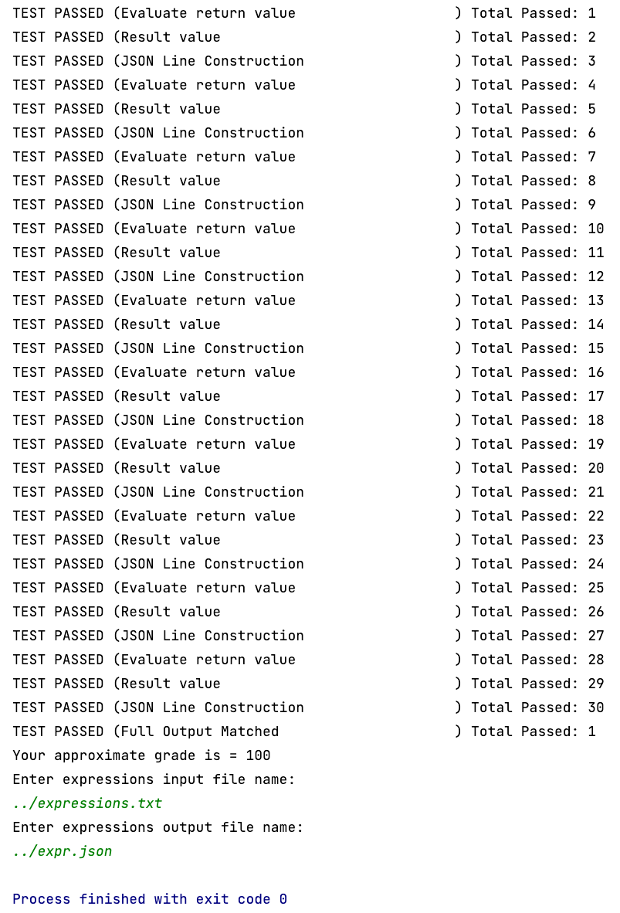

# LAB 1 - Evaluating Arithmetic Expressions

## Goal
Practice the methods offered by the C++ standard library string class by writing a C++ program that reads in an arithmetic expression evaluates the expression and finds the result of evaluation the expression. This lab will serve as practice and review of CSC 1230 topics as string class and methods, and file input/output.

## Sample Run

Here's a screenshot of a sample run:



The main program will do the following operations:
1. Calls the function `ValidateExpressions` on line 14. This function has been provided for you, and it will test the two functions that you need to implement for this lab. When the function is done, it is going to return a number that represents how many points out of one hundred you get for your tests. This will be most of your lab grade.
2. After the validation part you will write code to:
   1. Read from the keyboard the name of an input file, and then a name of an output file.
   2. Open the input file, report if there was an error (like file not found), if not continue.
   3. For each line on the input file (each line contains an arithmetic expression), you will evaluate the line and output a JSON line into the output file.

When passed an arithmetic expression as a string (`expression`) containing numbers and the binary operators `+`, `-`, `*`, `/`, and `%`, it will return a boolean value indicating if the expression was valid or not. If the expression was valid, the function will set the parameter `value` to what the expression evaluates to. If the expression was not valid, it will set the parameter `value` to zero.

Examples:
```c++
int v;
bool ok =  Evaluate("2+3+4", v);
```
The previous example would assign `true` to `ok` and `v` would have the value `9`.

```c++
int v;
bool ok =  Evaluate("2+3*4", v);
```
The previous example would assign `true` to `ok` and `v` would have the value `14`. Note that the multiplication is evaluated first.

```c++
int v;
bool ok =  Evaluate("2+3+4a", v);
```
The previous example would assign `false` to `ok` and `v` would have the value `0`. Note that the expression is not valid!

Examples

Evaluating `2+5*3-1`
```
Step 1:     2+15-1
Step 2:     17-1
Step 3:     16      Finished
```
Evaluating `4*5+10/2-1`
```
Step 1:     20+10/2-1
Step 2:     20+5-1
Step 3:     25-1
Step 4:     24      Finished
```

Evaluating `12+3*3-4a`
```
Step 1:     12+9-4a
Step 2:     21-4a   Finished
```

Note that the third example did not end on a number! So, the expression was not valid.

Some points to consider:

* You are NOT supposed to handle a unary minus sign (or unary plus sign for that matter).  Just ignore it `–` for instance the expression `-2` would evaluate `-2`.
* Characters appearing in the string that are neither digits nor one of the operators `+`, `-`, `*`, `/`, and `%` are to be ignored.  Just perform the operations that can be performed, and leave any other character where it is:
```
2+3+(5**2)A2 --> 5+(5**2)A2 No more simplification can be done!
```
* The only situation where your function will be allowed to generate an exception (i.e. crash) is division by zero.  No points will be deducted if the program crashes in this situation.

•	Do NOT try to “improve” on the above specification so that the output produced deviates from what is described above.  That will mean your program fails our testing, and you will lose correctness points.

## What the function `CreateJSONLine` should do

The function declaration is as follows:
```c++
string CreateJSONLine(const string& expression, int result, bool error);
```

This function takes in an arithmetic expression, the result of that expression (you'd need to have called `Evaluate` to know this value!) and a boolean indicating whether there was an error or not.
Examples:
```c++
string json = CreateJSONLine("2+3+4", 9, false);
```
The previous example would create a JSON line as follows:
```json
{"expr":"2+3+4", "result":9, "error":false}
```
The line indicates the original expression ("2+3+4"), the value that that expression evaluates to (9), and the error value that in this case is (false).

```c++
string json = CreateJSONLine("2+3*4", 9, false);
```
The previous example would create a JSON line as follows:
```json
{"expr":"2+3*4", "result":14, "error":false}
```
The line indicates the original expression ("2+3*4"), the value that that expression evaluates to (14), and the error value that in this case is false.


```c++
string json = CreateJSONLine("2+3+4a", 0, true);
```
The previous example would create a JSON line as follows:
```json
{"expr":"2+3+4a", "result":0, "error":true}
```
The line indicates the original expression ("2+3+4a"), the value that that expression evaluates to (0), and the error value that in this case is true, note that this expression cannot be evaluated.
